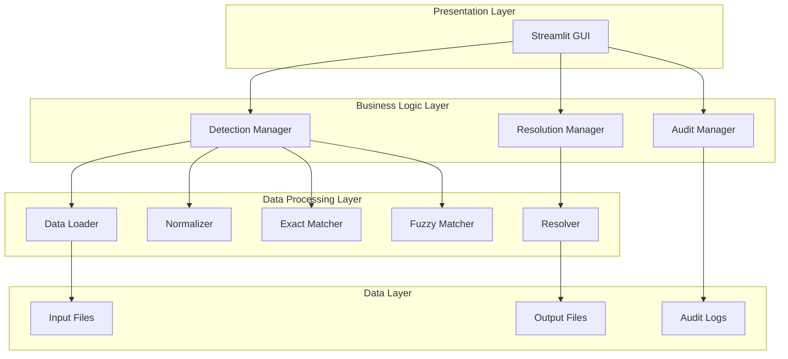

# Design Document: Intelligent Duplicate Detection & Cleanup System

## Overview

The Intelligent Duplicate Detection & Cleanup System is a Python-based application that provides automated detection, resolution, and auditing of duplicate records in structured data files. The system employs a modular architecture with distinct components for data loading, normalization, duplicate detection (both exact and fuzzy), human-in-the-loop resolution, and output generation.

The system is designed around performance efficiency, maintaining O(n) complexity for exact matching through hash-based algorithms, while providing configurable fuzzy matching with threshold-based pruning for performance optimization. A Streamlit-based GUI provides an intuitive interface for configuration, review, and approval of duplicate resolution decisions.

## Architecture

The system follows a layered architecture pattern with clear separation of concerns:



### Key Architectural Principles

1. **Separation of Concerns**: Each component has a single, well-defined responsibility
2. **Performance First**: Hash-based exact matching ensures O(n) complexity
3. **Human-Centric**: All destructive or ambiguous resolution decisions require human approval
4. **Audit Trail**: Complete traceability of all operations
5. **Extensibility**: Modular design allows for easy addition of new matching algorithms

### Resolution Decision Automation

The system employs a hybrid approach to resolution decisions:

- **Exact Duplicates**: Auto-approved for merge/keep operations (100% confidence)
- **Fuzzy Duplicates**: Require human approval due to uncertainty in similarity matching
- **Complex Cases**: Automatically flagged for mandatory human review
- **Destructive Operations**: Always require explicit user confirmation

## Components and Interfaces

### Data Loader (`core/loader.py`)

**Purpose**: Handles input file parsing and validation for CSV and JSON formats.

**Key Methods**:

- `load_csv(file_path: str) -> pd.DataFrame`: Loads and validates CSV files
- `load_json(file_path: str) -> pd.DataFrame`: Loads and validates JSON files
- `validate_data(df: pd.DataFrame) -> ValidationResult`: Validates data structure and content
- `get_preview(df: pd.DataFrame, rows: int = 10) -> pd.DataFrame`: Returns preview of data

**Error Handling**: Returns structured error messages for malformed files, encoding issues, and schema validation failures.

### Normalizer (`core/normalizer.py`)

**Purpose**: Standardizes data for consistent comparison while preserving original values.

**Key Methods**:

- `normalize_text(value: str) -> str`: Converts to lowercase, trims whitespace, handles special characters
- `normalize_date(value: str) -> str`: Standardizes date formats to ISO format
- `normalize_numeric(value: str) -> str`: Removes formatting characters, standardizes decimal representation
- `normalize_record(record: dict, fields: List[str]) -> dict`: Applies normalization to specified fields
- `create_composite_key(record: dict, key_fields: List[str]) -> str`: Creates normalized composite keys

**Design Decision**: Maintains both original and normalized versions to ensure data integrity in final output.

### Exact Matcher (`core/exact_matcher.py`)

**Purpose**: Performs hash-based duplicate detection with O(n) time complexity.

**Key Methods**:

- `find_exact_duplicates(df: pd.DataFrame, key_fields: List[str]) -> List[DuplicateGroup]`: Main detection method
- `create_hash_key(record: dict, fields: List[str]) -> str`: Creates hash keys for comparison
- `group_duplicates(matches: Dict[str, List[int]]) -> List[DuplicateGroup]`: Groups duplicate records

**Algorithm**: Uses Python's built-in hash functions with composite key generation for multi-field matching.

### Fuzzy Matcher (`core/fuzzy_matcher.py`)

**Purpose**: Performs similarity-based duplicate detection using RapidFuzz library.

**Key Methods**:

- `find_fuzzy_duplicates(df: pd.DataFrame, fields: List[str], threshold: float) -> List[DuplicateGroup]`: Main fuzzy detection
- `calculate_similarity(record1: dict, record2: dict, fields: List[str]) -> float`: Computes similarity score
- `apply_threshold_pruning(candidates: List[Tuple], threshold: float) -> List[Tuple]`: Performance optimization

**Performance Optimization**:

- **Blocking Strategy**: Records are partitioned into smaller candidate groups using lightweight keys (e.g., first letter, email domain, phone prefix). Fuzzy matching is applied only within blocks to reduce unnecessary comparisons and avoid quadratic behavior.
- **Threshold-based Pruning**: Eliminates low-similarity comparisons early within each block
- **Field-specific Weighting**: Composite similarity scores with configurable field importance
- **Configurable Algorithms**: Support for multiple similarity algorithms (Levenshtein, Jaro-Winkler, etc.)

### Resolver (`core/resolver.py`)

**Purpose**: Applies user-approved resolution decisions to duplicate groups.

**Key Methods**:

- `apply_resolution(df: pd.DataFrame, decisions: List[ResolutionDecision]) -> pd.DataFrame`: Applies all decisions
- `soft_delete(df: pd.DataFrame, record_ids: List[int]) -> pd.DataFrame`: Marks records as duplicates
- `hard_delete(df: pd.DataFrame, record_ids: List[int]) -> pd.DataFrame`: Permanently removes records
- `merge_records(records: List[dict]) -> dict`: Merges multiple records using business rules
- `select_best_record(records: List[dict]) -> dict`: Selects record with most non-null fields and latest timestamp

**Merge Logic**:

1. Prioritize record with most non-null fields
2. For ties, select record with latest timestamp
3. For remaining ties, select first record encountered
4. Preserve all original record IDs in audit trail

## Data Models

### Determinism Guarantee

Given the same input data and configuration, the system produces deterministic outputs. This is achieved through:

- Consistent record ordering during processing
- Deterministic tie-breaking rules in merge operations
- Fixed random seeds for any probabilistic operations
- Reproducible blocking and comparison strategies

### Core Data Structures

```python
@dataclass
class DuplicateGroup:
    """Represents a group of duplicate records"""
    group_id: str
    records: List[dict]
    similarity_score: float
    detection_method: str  # 'exact' or 'fuzzy'
    recommended_action: str  # 'keep_first', 'merge', 'flag'

@dataclass
class ResolutionDecision:
    """User's decision for resolving a duplicate group"""
    group_id: str
    action: str  # 'KEEP', 'DELETE', 'MERGE', 'FLAG'
    selected_records: List[int]  # Record IDs to keep/merge
    user_notes: Optional[str]
    timestamp: datetime

@dataclass
class AuditEntry:
    """Single entry in the audit log"""
    record_id: str
    action: str
    reason: str
    similarity_score: Optional[float]
    timestamp: datetime
    user_decision: bool  # True if user-approved, False if automatic

@dataclass
class ValidationResult:
    """Result of data validation"""
    is_valid: bool
    errors: List[str]
    warnings: List[str]
    record_count: int
    field_names: List[str]

@dataclass
class ProcessingStats:
    """Statistics from duplicate detection process"""
    total_records: int
    duplicate_groups_found: int
    exact_duplicates: int
    fuzzy_duplicates: int
    processing_time: float
    memory_usage: float
```

### Configuration Models

```python
@dataclass
class MatchingConfig:
    """Configuration for duplicate detection"""
    exact_matching_enabled: bool
    fuzzy_matching_enabled: bool
    fuzzy_threshold: float  # 0-100
    key_fields: List[str]
    fuzzy_fields: List[str]
    similarity_algorithm: str  # 'levenshtein', 'jaro_winkler', etc.

@dataclass
class ResolutionConfig:
    """Configuration for duplicate resolution"""
    default_action: str
    require_confirmation_for_hard_delete: bool
    merge_strategy: str  # 'most_complete', 'latest_timestamp', 'manual'
    preserve_original_ids: bool
```

## Correctness Properties

*A property is a characteristic or behavior that should hold true across all valid executions of a system—essentially, a formal statement about what the system should do. Properties serve as the bridge between human-readable specifications and machine-verifiable correctness guarantees.*

### File Parsing Properties

**Property 1: CSV and JSON parsing consistency**
*For any* valid CSV or JSON file, parsing it should produce a structured DataFrame with the correct number of records and field names
**Validates: Requirements 1.1, 1.2**

**Property 2: Error handling for malformed data**
*For any* malformed input file, the system should return descriptive error messages without crashing
**Validates: Requirements 1.3, 10.1**

**Property 3: Preview functionality**
*For any* successfully loaded dataset, the preview should contain exactly the requested number of records (up to the total available)
**Validates: Requirements 1.4**

### Duplicate Detection Properties

**Property 4: Exact matching field selection**
*For any* combination of fields selected for exact matching, records with identical values in those fields should be grouped together
**Validates: Requirements 2.2**

**Property 5: Composite key duplicate detection**
*For any* set of fields defined as a composite key, records with identical composite key values should be detected as exact duplicates
**Validates: Requirements 2.3**

**Property 6: Exact duplicate similarity scores**
*For any* group of exact duplicates, all records in the group should have a similarity score of 100%
**Validates: Requirements 2.4**

**Property 7: Fuzzy matching threshold filtering**
*For any* similarity threshold setting, only record pairs with similarity scores above the threshold should be flagged as fuzzy duplicates
**Validates: Requirements 3.2**

**Property 8: Fuzzy matching normalization**
*For any* text fields being compared, fuzzy matching should apply normalization before calculating similarity scores
**Validates: Requirements 3.3**

**Property 9: Similarity score bounds**
*For any* fuzzy duplicate detection, all similarity scores should be between 0 and 100 inclusive
**Validates: Requirements 3.4**

### Data Normalization Properties

**Property 10: Comprehensive normalization**
*For any* data record, normalization should consistently apply lowercase conversion, whitespace trimming, date standardization, and numeric formatting removal while preserving original data
**Validates: Requirements 4.1, 4.2, 4.3, 4.4**

**Property 11: Normalization round-trip consistency**
*For any* valid data record, normalizing then formatting then normalizing should produce equivalent results
**Validates: Requirements 4.6**

### Resolution Engine Properties

**Property 12: Resolution decision execution**
*For any* user-approved resolution decision, the system should correctly execute the specified action (KEEP, DELETE, MERGE, FLAG)
**Validates: Requirements 5.5**

**Property 13: Complex case flagging**
*For any* duplicate group that meets complexity criteria, the system should flag it for mandatory human review
**Validates: Requirements 5.6**

**Property 14: Soft delete data preservation**
*For any* record marked for soft deletion, the original data should be preserved while the record is marked as a duplicate
**Validates: Requirements 6.2**

**Property 15: Merge logic completeness**
*For any* set of records being merged, the result should be the record with the most non-null fields, with timestamp-based tiebreaking when applicable
**Validates: Requirements 6.4, 6.5**

### Output and Audit Properties

**Property 16: Output format consistency**
*For any* input file format (CSV or JSON), the cleaned output should be generated in the same format with preserved structure
**Validates: Requirements 8.1**

**Property 17: Comprehensive audit logging**
*For any* action taken during duplicate resolution, an audit entry should be created containing Record ID, Action, Reason, Score, and Timestamp
**Validates: Requirements 6.6, 8.2, 11.1**

**Property 18: Summary report completeness**
*For any* completed processing session, the summary report should contain total records, duplicates detected, and execution time
**Validates: Requirements 8.3, 9.4**

**Property 19: Data integrity preservation**
*For any* data processing operation, no data corruption or loss should occur from input to output
**Validates: Requirements 8.4, 11.3**

**Property 20: File format validation**
*For any* generated output file, it should be valid in its respective format (CSV or JSON) and parseable by standard libraries
**Validates: Requirements 8.5**

**Property 21: Complete round-trip consistency**
*For any* generated output file, parsing then formatting then parsing should produce equivalent data structures
**Validates: Requirements 8.6**

### Error Handling and Logging Properties

**Property 22: Comprehensive error logging**
*For any* processing error that occurs, detailed information should be logged for debugging purposes
**Validates: Requirements 10.2**

**Property 23: Configuration validation**
*For any* invalid configuration detected, the system should prevent execution and provide explanatory error messages
**Validates: Requirements 10.3**

**Property 24: Graceful degradation**
*For any* system limit exceeded, the system should handle the situation gracefully with informative messages
**Validates: Requirements 10.4**

**Property 25: Activity logging completeness**
*For any* operation performed, comprehensive logs should be maintained of all activities
**Validates: Requirements 10.5**

### Data Integrity and Traceability Properties

**Property 26: Original identifier preservation**
*For any* duplicate resolution applied, original record identifiers should be preserved in the audit trail
**Validates: Requirements 11.2**

**Property 27: Audit log compliance**
*For any* audit log created, it should include sufficient detail to meet compliance requirements
**Validates: Requirements 11.4**

**Property 28: End-to-end traceability**
*For any* data processing session, complete traceability should be maintained from input to output
**Validates: Requirements 11.5**

## Error Handling

The system implements comprehensive error handling at multiple levels:

### Input Validation Errors

- **File Format Errors**: Invalid CSV/JSON structure, encoding issues, missing headers
- **Data Type Errors**: Incompatible data types, missing required fields, invalid field names
- **Size Limit Errors**: Files exceeding memory limits, too many records for processing

### Processing Errors

- **Configuration Errors**: Invalid field selections, incompatible matching settings, threshold out of range
- **Algorithm Errors**: Fuzzy matching failures, hash collision handling, memory allocation issues
- **Resolution Errors**: Invalid resolution decisions, merge conflicts, audit trail failures

### Error Response Strategy

1. **Immediate Feedback**: Real-time validation with specific error messages
2. **Graceful Degradation**: Continue processing when possible, flag problematic records
3. **Comprehensive Logging**: Detailed error information for debugging and audit purposes
4. **User Guidance**: Actionable suggestions for resolving configuration and data issues

## Testing Strategy

### Security and Privacy Considerations

The system assumes trusted local execution environment. In production deployments, additional security measures would be required including data encryption at rest and in transit, access controls, audit logging, and compliance with data protection regulations (e.g., GDPR, CCPA). The current design focuses on functional correctness and performance optimization.

### Out of Scope

The following capabilities are explicitly excluded from this system design:

- **Real-time Streaming**: Batch processing only, no real-time data ingestion
- **Distributed Execution**: Single-machine processing, no Spark/Hadoop integration  
- **Fully Autonomous Resolution**: Human oversight required for ambiguous cases
- **Unstructured Data**: Structured tabular data only (CSV/JSON), no PDFs or images
- **Production Security**: Authentication, authorization, and encryption not implemented
- **Multi-tenant Architecture**: Single-user local execution environment

The system employs a dual testing approach combining unit tests for specific scenarios and property-based tests for comprehensive coverage:

### Unit Testing Focus

- **Specific Examples**: Test known duplicate scenarios and edge cases
- **Integration Points**: Verify component interactions and data flow
- **Error Conditions**: Validate error handling for malformed inputs and invalid configurations
- **UI Components**: Test Streamlit interface components and user interactions

### Property-Based Testing Configuration

- **Library**: Hypothesis for Python property-based testing
- **Iterations**: Minimum 100 iterations per property test for statistical confidence
- **Test Tagging**: Each property test tagged with format: **Feature: intelligent-duplicate-detection, Property {number}: {property_text}**
- **Data Generation**: Custom generators for CSV/JSON data, duplicate scenarios, and configuration combinations

### Test Coverage Requirements

- **Core Logic**: All duplicate detection algorithms must have both unit and property tests
- **Data Integrity**: Round-trip properties for all file I/O and data transformation operations
- **Error Handling**: Property tests for error conditions with generated invalid inputs
- **Performance**: Unit tests for algorithmic complexity validation and memory usage monitoring

### Testing Implementation Guidelines

- Each correctness property must be implemented by a single property-based test
- Property tests should generate diverse input scenarios to maximize coverage
- Unit tests should focus on specific examples that demonstrate correct behavior
- Integration tests should verify end-to-end workflows through the GUI interface
- Performance tests should validate O(n) complexity claims and memory efficiency
